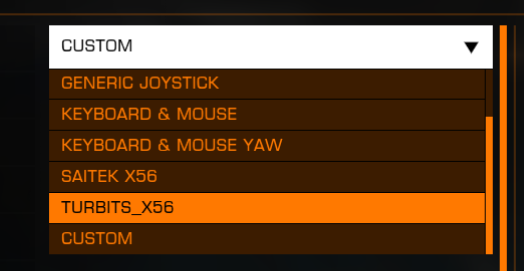

# elite dangerous configuration and helpers

### saitek x56 rhino joystick/throttle

install Logitech X56 software first:
- [Logitech Support](https://support.logi.com/hc/en-us/articles/360025130494-X56-Space-Flight-H-O-T-A-S-Software)
- [Archive.org backup link](https://web.archive.org/web/20250000000000*/https://support.logi.com/hc/en-us/articles/360025130494-X56-Space-Flight-H-O-T-A-S-Software)

copy binds file to `%LOCALAPPDATA%\Frontier Developments\Elite Dangerous\Options\Bindings\turbits_x56.X.Y.binds` (replace X.Y with your game version, e.g. 4.2)

[!WARNING]
>if you are getting odd behaviour or the binds dont work, check to make sure the game version hasn't changed. the binds file itself has the major/minor versions of the game hardcoded in a XML tag at the top of the file. that, or you haven't installed the Logi x56 software.

#### x56 helper script

script: `EliteDangerous_X56_Launcher.ps1`
flags:
- `-NoBackup` : do not create backup of existing binds file

optionally use the `EliteDangerous_X56_Launcher.ps1` powershell script to launch ED, it will check for the X56 joy/throttle, ensure the `turbits_x56.X.Y.binds` bind file exists, and then launch the game via steam

[!NOTE]
>do note that the launcher script by default will save backup binds files to `C:\temp\EDBindBackups`. if you dont like that, make sure you change it or pass in the `-NoBackup` flag when running script. the file is only about 65KB, but something to keep in mind over time.

